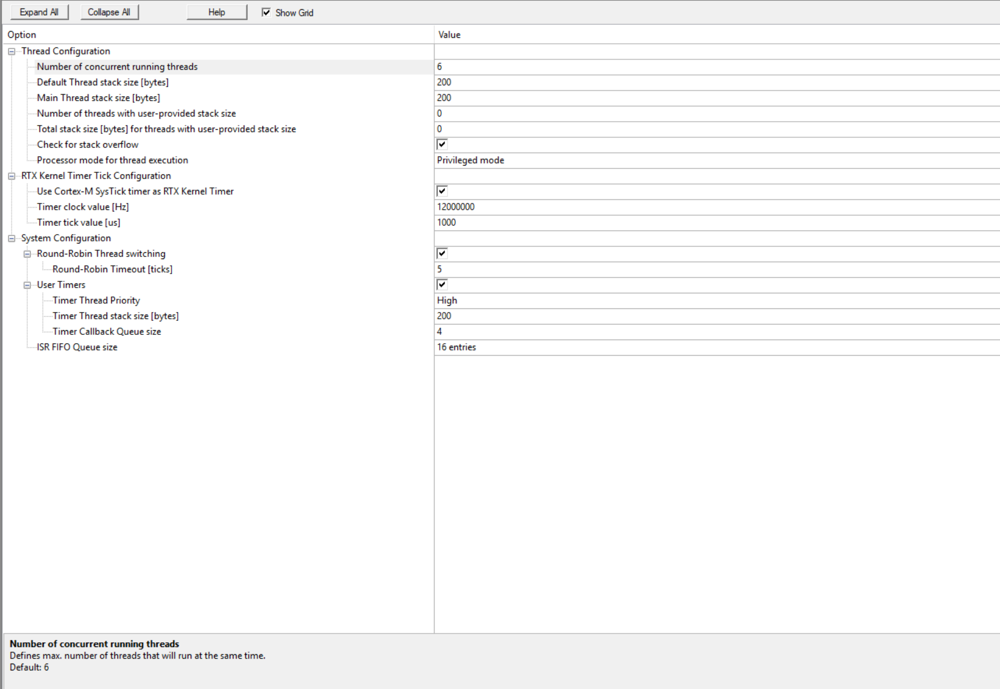
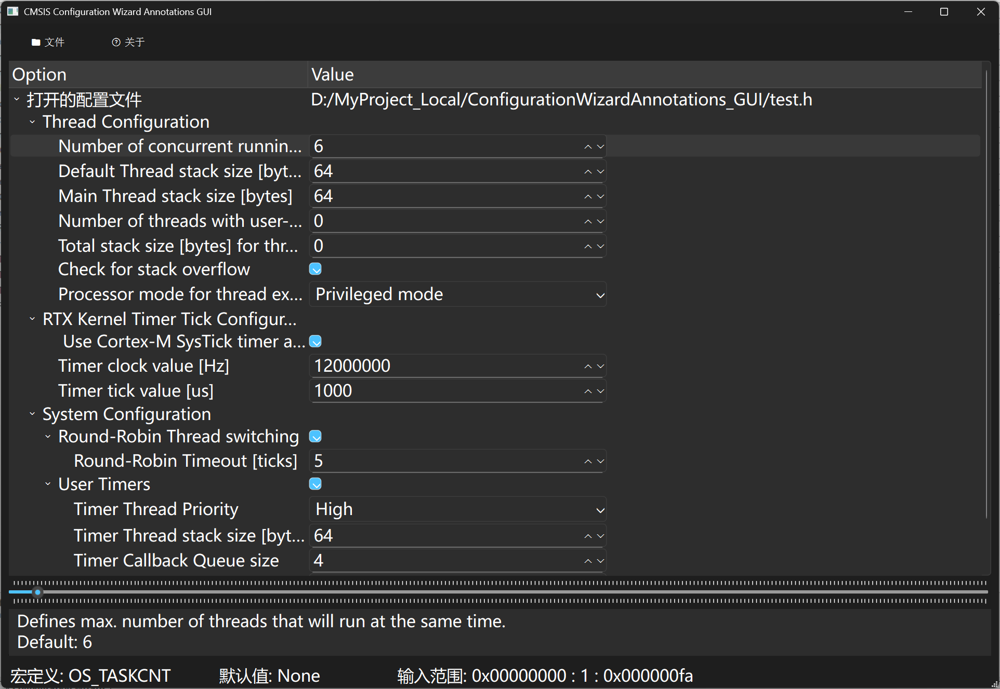
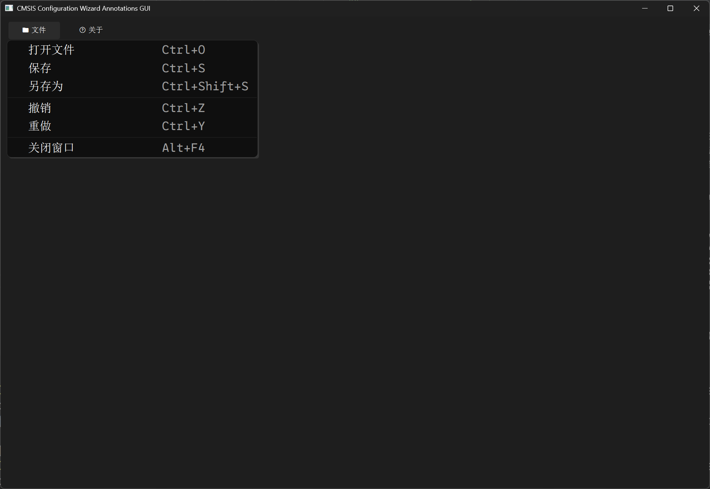
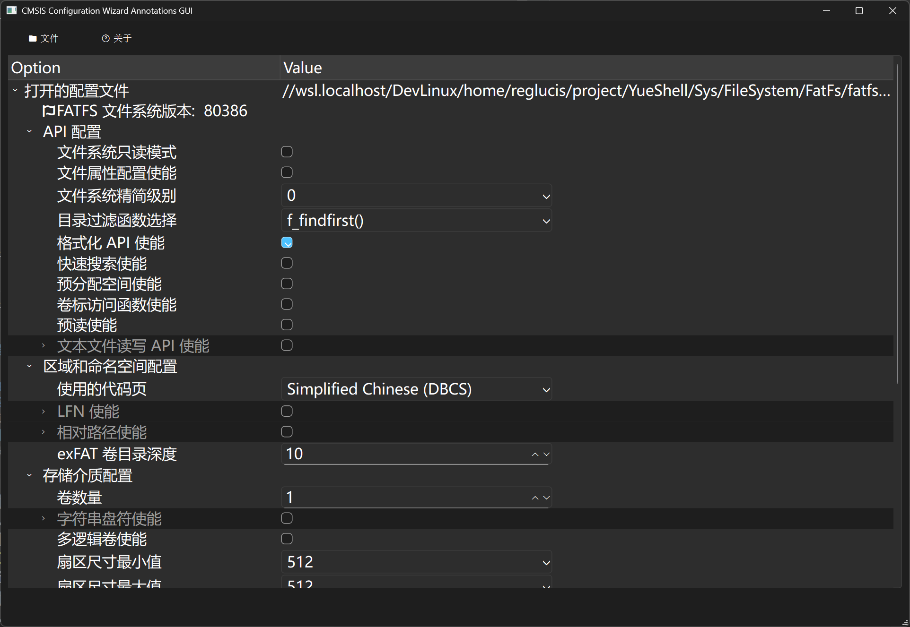
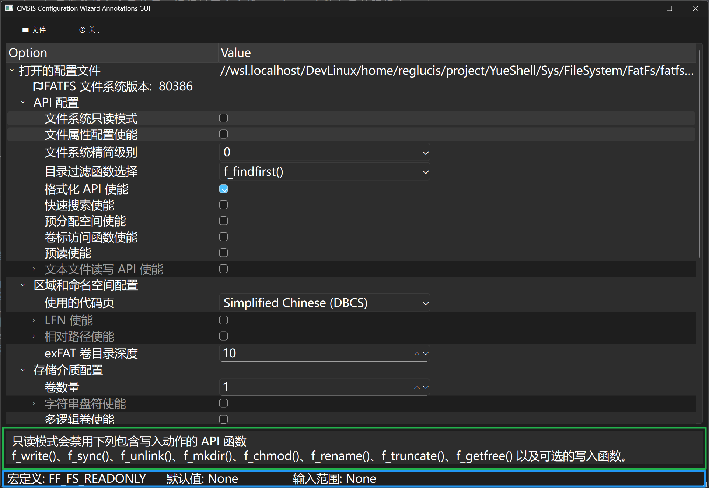
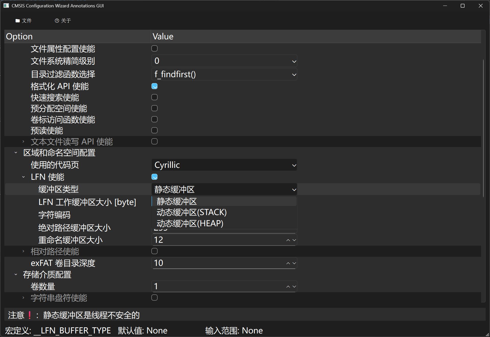
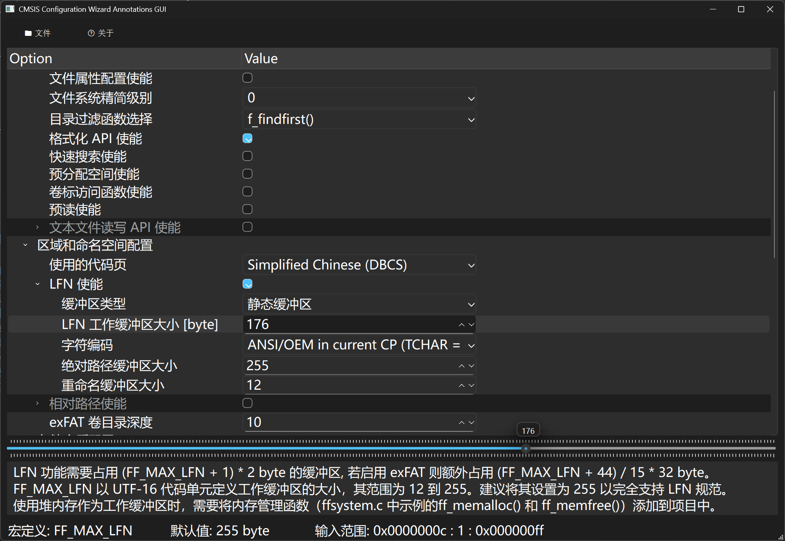

# ConfigurationWizardAnnotations_GUI

## 关于本项目
这是一个为了在 keil 以外也可以使用 Configuration Wizard Annotations 来配置头文件的项目。
笔者使用 vscode 作为主力编辑器，早期使用 keil 作为编辑器时留下的 GUI 配置文件一直无法使用。一方面为此专门弄个 keil 有些累赘，另一方面 keil 对 UTF-8 编码的支持也不够好（~~绝对不是嫌弃 keil 太丑了~~）。于是便诞生了该项目。

下方是 keil 与本程序界面对比。

## Configuration Wizard Annotations
Configuration Wizard Annotations 由注释项和注释修饰符组成。它们在 IDE 中为配置文件创建类似 GUI 的元素。使用类似 GUI 的方法使用户可以更轻松地检查和调整配置文件以适应应用程序需求。

 > CMSIS 语法标准 https://open-cmsis-pack.github.io/Open-CMSIS-Pack-Spec/main/html/configWizard.html

## 使用说明

### 环境配置
本项目依赖于 pyside6 GUI 库。如果您希望在全局使用，运行以下命令将 pyside6 安装在系统环境中；如果和其他程序产生依赖冲突，请在虚拟环境中运行该程序，关于如何使用虚拟环境不在此赘述。
``` bash
pip install pyside6 --break-system-packages
```

### 软件使用
运行软件即可得到下方主页面。目前仅实现了打开文件与保存，事情比较多暂时不实现其他功能了(~~绝对不是懒~~)


选择配置文件打开后可得到


当选择可配置条目时会在下方状态栏显示相关信息。
绿色框为对该条目的说明，即语法中的 \<i> 标签。这个信息浮窗会根据文本长度自动弹出，无信息时将隐藏。
下方蓝色框展示了配置项对应的宏定义条目、默认值(\<d> 标签)以及可选的范围。


可选条目禁用情况下无法展开，使能后自动展开。


当存在输入范围时，将会在信息浮窗上再弹出一个拖动条(左键按下时会显示浮标)。可以在对应条目内的输入框内输入数字（支持以0x开头的十六进制输入），也可使用微调按钮调整和可以使用拖动条来输入。
（注意, 当刻度过多时 pyside6 GUI 接口会卡死，因此一些条件下拖动条会被禁用。）


使用后，保存即可。安全模式下，会自动生成一个 .bak 文件备份修改前的文件。
目前仅支持一次运行打开一个文件，如果想打开其他文件请重启软件。

## 语法说明
个人认为 CMSIS 标准提供了强大的自定义功能，远远超出平时的使用需求, 因此推荐使用下方的精简符号表。本程序优先保证基础符号表内的符号解析正确，在此基础上，尽可能支持 CMSIS 标准并与 keil 解析保持一致。

## ‼️ 预期外的 Configuration Wizard Annotations 语法规则 ‼️
+ 🗨️ 本程序不严格要求 '<' '>' 的出现, 但仍建议在 Configuration 区域内不要使用该字符
+ ❗ CMSIS 标准不允许预期外的'<' '>' 使用
+ 🗨️	<c> 或者 <!c> 状态以第一个有效行(可以为空行)为准, 激活时取消注释第一个有效行至结束符内的全部行
+ ❗ 该语法有着与 keil 不同的行为	( keil 会注释或取消全部注释，而非切换 )
+ ❗ 本程序不支持指定被绑定的宏定义，如 <o MODIFY_THIS> --> #define MODIFY_THIS 0
+ ❗ keil 不支持 <d> 语法😓
+ ❗ keil 不支持在使用 MODIFIER 时使用浮点数，如 <53.2-99.7:0.3>
+ ❗ keil 列表，不支持使用浮点数或字符串，如 <1.2=> 低缩放	<USER_PORT=> 用户端口
+ 🗨️ 本程序支持添加了对浮点数的支持，但并未完善与测试，仍停留在相当早期的版本。

##   ❌ 已知问题 ❌
+ 在 Configuration Wizard Annotations 区域内不可以跨行 如 /* */ () 等符号跨行使用会产生预期外的错误
+ 当 <c> 将整个区域被注释时，区域内的元素无法正确绑定
+ 当范围数字过大时，SpinBox 会溢出 如:0x1 0000 0000

## 更新计划：
+ 加入编辑条目功能，允许用户在 GUI 添加定义项，计划中的受支持列表					
+ 若加入使用默认值复原的功能，需要加强语法定义：约定第一个值位复位值，如 <d> 120000000 12MHz
+ 拓展语法 <!q> <!e> 用于表示需要取反的值，如使能只读模式时，需要禁用子项。

#       👍 推荐符号表 💕 
```
标识区域开始:           <<< Use Configuration Wizard in Context Menu >>>
标识区域结束:           <<< end of configuration section >>>
分组：
    分组(仅标签)        <h>                                 // V0.1
    可使能的分组        <e>                                 // V0.1
    区域注释分组        <c> 或 <!c>                         // TODO
元素:
    定义数字            <o>                                 // V0.1
    定义使能位          <q>                                 // V0.1
    定义字符串          <s>                                 // beta
    定义数组            <a>                                 // 未实现 不便于在现有 UI 中展示（过长）
    继承已存在符号      <y>                                 // 不建议通过 GUI 输入
    通过列表选择        <o> 或 <y>                           // V0.1
    详细信息            <i>                                 // V0.1
    默认值              <d>                                 // V0.1
修饰符:
    指明可修改的位      <?.x> 或 <o.x..y>       ?=o,q        // beta
    指明范围(步长)      <x-y>  <x-y:s>                       // V0.1
    指明列表元素        <元素=> 描述                          // V0.1
```

#### 吐槽
低情商：nnd 标准这个乱，解析器要写吐了。
大量不需要的语法，神经病吧。跳过 x 个宏定义，你就不能写外面或调整一下宏定义顺序？
指定修改的宏定义，中间的不需要修改的宏定义你就不能写在区域外。纯有病
还有文本，添加一个纯文本。请你告诉我有什么用，不能写在详细信息里么？
添加一段纯文本信息作为叶节点的意义何在？分隔符咩？分组让你吃了？(可以用 \<h> 文本 \</h> 替代)
还有对显示值的修饰，嵌套一层宏定义不就得了。不过确实能方便点。   

#### 免责声明
因此程序造成任何损失概不负责，使用时请遵守开源协议。
这是笔者第一个较为完整的 python 应用，从来没较系统地学习过 python （变量类型都分不清那种，至今都不清楚元组和列表的使用区别😓）。
大多时候都是俺寻思能行就写出来了，所以代码质量较为低劣，如有 bug 和建议欢迎提出 issue 。
